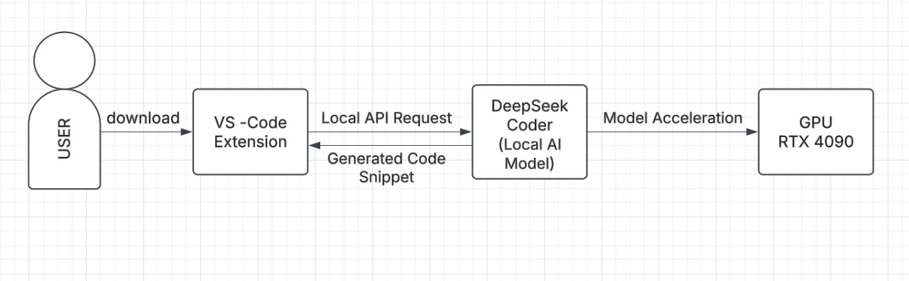

# **CodeGenie-G329-PS25**
## 📌Purpose of our Project

Our aim is to enhance developer productivity by integrating an **AI-powered code generation tool** directly into VS Code. This tool will allow developers to **generate context-aware code snippets** instantly by typing a prompt, leveraging the power of DeepSeek Coder (via Ollama) for AI-driven code suggestions.

## 📌Key Goals & Objectives  
**AI-Powered Code Generation**  
•	Utilize DeepSeek Coder to generate accurate & intelligent code completions.  
•	Improve coding efficiency by reducing manual effort.  
**Seamless VS Code Integration**  
•	Build a custom VS Code extension that provides real-time code suggestions.  
•	Allow users to input a prompt and receive AI-generated code instantly.  
**Optimized Performance with GPU Acceleration**  
•	Run DeepSeek Coder locally on an RTX 4090 GPU for fast & efficient inference.  
•	Reduce latency and enhance developer experience.  
**Enhanced Developer Workflow**  
•	Assist programmers by automating repetitive tasks.  
•	Improve code quality by providing contextually relevant AI-driven snippets.  
•	Support multiple programming languages & frameworks.  

# 📌Applications

**AI Powered Code Autocompletion**  
•  **Use Case**: Developers get real-time intelligent code suggestions while typing.  
•	**Benefit**: Reduces time spent on writing boilerplate code and improves efficiency.  

**Code Generation from Natural Language Prompts**  
•	**Use Case**: Users can type a prompt (e.g., "Create a Python function to sort a list") and get auto-generated code.  
•	**Benefit**: Helps beginners learn programming and speeds up development.  

**Automated Code Documentation & Comments**  
•	**Use Case**: AI can generate meaningful docstrings and inline comments.  
•	**Benefit**: Improves code readability and maintainability.  

 **Debugging & Error Fixing**  
•	**Use Case**: The extension can suggest fixes for common programming errors.  
•	**Benefit**: Helps developers identify and resolve bugs faster.  

**Multi-Language Code Support**  
•	**Use Case**: Works across various languages like Python, JavaScript, C++, etc.  
•	**Benefit**: Versatile tool for developers working with multiple technologies.  

**Code Refactoring & Optimization**  
•	**Use Case**: AI suggests efficient alternatives to improve performance.  
•	**Benefit**: Helps in writing cleaner and optimized code.  

**Learning & Skill Development**  
•	**Use Case**: Assists students and beginners in understanding coding patterns.  
•	**Benefit**: Makes learning to code easier & more interactive.  

## **📌Architecture Diagram**

## **📌AI Model Architecture**  

## **📌Workflow Diagram**  

# 📌Summary Of Reseach Paper
1.**Introduction to DeepSeek-Coder**  
DeepSeek-Coder is an open-source large language model (LLM) designed specifically for programming tasks. Unlike closed-source models like GPT-3.5 or Codex, it is openly available for research and commercial use. DeepSeek-Coder comes in multiple sizes, from 1.3B to 33B parameters, and is trained on 2 trillion tokens across 87 programming languages. The model is optimized for code generation, completion, and infilling and supports long-context understanding with 16K token windows.

2.**Data Collection & Preprocessing**  
DeepSeek-Coder's training data is carefully curated using a repository-level data organization rather than just individual code files. This improves the model’s understanding of cross-file dependencies. The dataset consists of:

87% source code  
10% code-related English natural language  
3% code-unrelated Chinese text  
The data is filtered using rule-based techniques, dependency parsing, and repo-level deduplication to remove   low-quality, redundant, or erroneous code. The dataset is sourced primarily from GitHub, StackExchange, and high-quality documentation.  

3.**Training Strategies (Next Token Prediction & FIM)**
DeepSeek-Coder uses two main training strategies:  
**Next Token Prediction:**  
The model predicts the next token based on previous tokens.
Improves general code generation skills.  
**Fill-In-the-Middle (FIM):**  
Instead of just predicting the next token, the model can fill in missing code between given context blocks.  
Uses Prefix-Suffix-Middle (PSM) and Suffix-Prefix-Middle (SPM) training modes.  
Enhances code infilling, making it useful for editing and debugging.  
FIM improves the model’s performance in real-world coding environments where developers often modify existing code rather than writing from scratch.  

4.**Model Architecture & Optimization**
DeepSeek-Coder follows a Transformer-based decoder-only architecture, similar to CodeLlama and GPT models. Key architectural features:  
**RoPE (Rotary Position Embedding)**: Supports long-context processing (16K+ tokens).  
**Grouped-Query Attention (GQA)**: Improves efficiency in large models.  
**FlashAttention v2**: Speeds up training and inference.  
**SwiGLU** activation for better performance.  
For optimization:  
**AdamW optimizer** with dynamic learning rate scheduling.
Three-stage learning rate decay policy with warm-up steps.
Multi-GPU parallelism (Tensor, ZeRO, and Pipeline Parallelism) to efficiently train on A100 and H800 GPU clusters.

5.**Evaluation Benchmarks & Comparisons**  
DeepSeek-Coder is benchmarked against other leading code models using:  
**HumanEval & MBPP**: Measures code correctness.  
**DS-1000**: Evaluates data science workflows.  
**LeetCode Contest Benchmark**: Tests real-world competitive programming problems.  
**CrossCodeEval**: Assesses cross-file completion.  
**Math Reasoning Benchmarks**: Tests mathematical problem-solving with code.  
Results show DeepSeek-Coder-Base 33B outperforms open-source competitors (CodeLlama, StarCoder) and DeepSeek-Coder-Instruct 33B even surpasses GPT-3.5 Turbo in many programming tasks.

6.**Code Generation & Completion**
DeepSeek-Coder excels in code generation across multiple languages (Python, C++, Java, JavaScript, etc.). The model performs better than CodeLlama-33B in:  
Generating entire programs  
Fixing bugs  
Writing library-specific functions  
It also supports Fill-in-the-Middle (FIM), making it highly effective for auto-completion tools.  

7.**Cross-File Code Understanding**
Unlike basic code models, DeepSeek-Coder understands dependencies between multiple files in a project. The model:   
Parses cross-file relationships using dependency graphs.  
Uses repository-level training instead of isolated files.  
Outperforms other models in CrossCodeEval benchmarks, proving its effectiveness in large-scale projects.  
This makes DeepSeek-Coder more useful for real-world software development compared to file-level models.  

8.**Program-Based Math Reasoning**
DeepSeek-Coder is also tested for math problem-solving using programming.   
Benchmarks include:  
GSM8K & MATH (Complex math reasoning)  
GSM-Hard, SVAMP, TabMWP (Mathematical word problems)  
It outperforms CodeLlama-Base 34B in these tasks, proving its strong numerical reasoning ability. This makes it useful for scientific computing, AI research, and data analysis.  

  
DeepSeek-Coder is an open-source coding LLM, trained on a vast dataset covering 87 languages.  
Uses Next Token Prediction & Fill-In-the-Middle (FIM) for code generation and completion.  
Optimized architecture enables long-context understanding and efficient training.  
Benchmark results show it outperforms CodeLlama, StarCoder, and even GPT-3.5 in some tasks.  
Supports cross-file understanding, making it ideal for software development.  
Has strong program-based math reasoning, beneficial for data science & AI applications.
| No. | Name       | Mstn | Video Link                                       | PPT Link                                      |
|-----|------------|------|--------------------------------------------------|-----------------------------------------------|
| 1   | Sanjana    | 1    | [▶](https://youtu.be/PuW-eL2CU94)                | [📄](https://tinyurl.com/mvrchvxt)           |
|     |            | 2    | [▶](https://youtu.be/j0y9y3iYvbo)                | [📄](https://tinyurl.com/yc3ukrr2)           |
| 2   | Nischala   | 1    | [▶](https://youtu.be/Blr5t0T7KNI)                | [📄](https://tinyurl.com/3jc9kzzn)           |
|     |            | 2    | [▶](https://youtu.be/6KSw23o2Bho)                | [📄](https://tinyurl.com/5523urdf)           |
| 3   | Amulya     | 1    | [▶](https://youtu.be/4fE0m_aqEz0)                | [📄](https://tinyurl.com/56jmus7e)           |
|     |            | 2    | [▶](https://youtu.be/NFWoY9R5Zzk)                | [📄](https://tinyurl.com/2wathpp6)           |
| 4   | Shraddha   | 1    | [▶](https://youtu.be/bNaBBOZ65XU)                | [📄](https://tinyurl.com/42a4ufrz)           |
|     |            | 2    | [▶](https://youtu.be/JaiYusulTZg)                | [📄](https://tinyurl.com/3turjdsn)           |
| 5   | Deeshna    | 1    | [▶](https://youtu.be/A4tUmq-kHMM)                | [📄](https://tinyurl.com/3dazkdfz)           |
|     |            | 2    | [▶](https://youtu.be/lZrzrV6P3KU)                | [📄](https://tinyurl.com/3cwp3p7x)           |
| 6   | Keerthana  | 1    | [▶](https://youtu.be/ajR3YI0rprU)                | [📄](https://tinyurl.com/3efxh8b7)           |
|     |            | 2    | [▶](https://youtu.be/rjzgzIpC-LI)                | [📄](https://tinyurl.com/mr8bm4n6)           |
| 7   | Abhinavi   | 1    | [▶](https://youtu.be/8cE342UEfeg)                | [📄](https://tinyurl.com/jad9j585)           |                
|     |            | 2    | [▶](https://youtu.be/XQK_rlVwIFU)                | [📄](https://tinyurl.com/4mp2necd)
